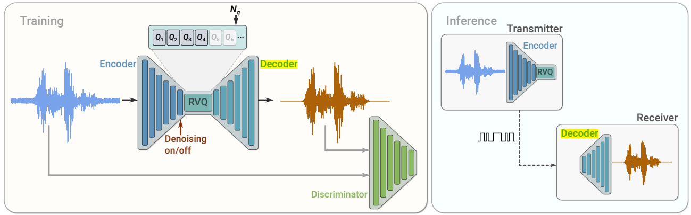
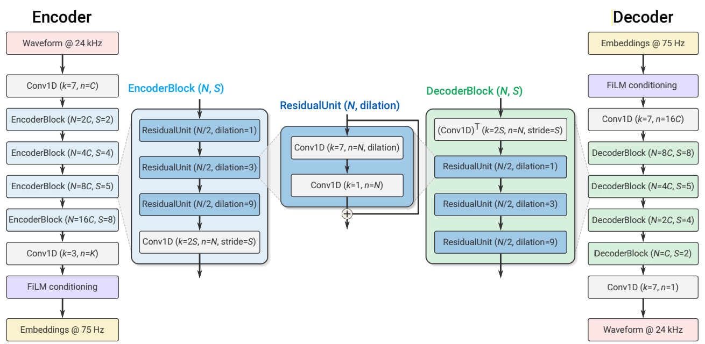
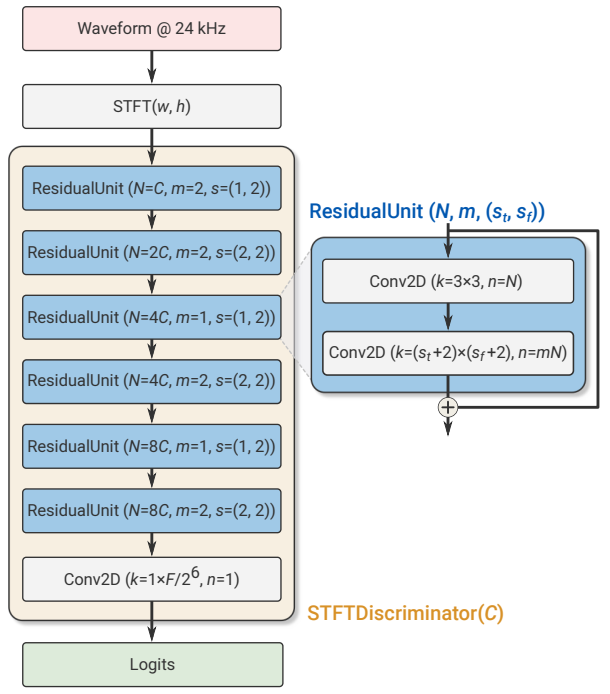
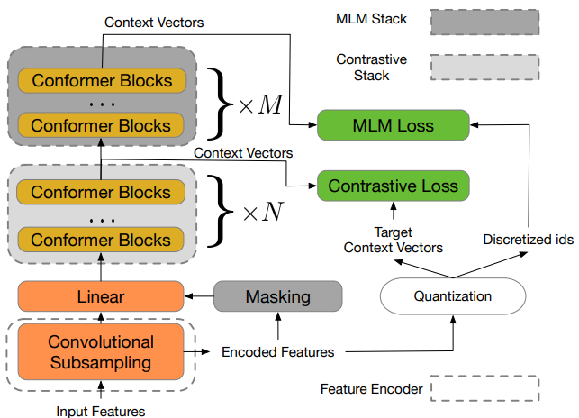
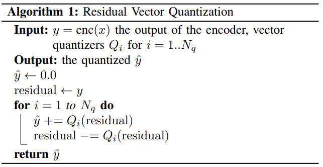

# AudioLM: a Language Modeling Approach to Audio Generation

AudioLM is a model that generates audio in the waveform domain.

It uses 2 tokenizers: `Soundstream` to compute the Acoustic tokens and `w2v-BERT` to compute the Semantic tokens.

### Soundstream: Acoustic Tokens

Soundstream [2] is a SOTA neaural audio codec. The model has 3 parts:
- Encoder
- Residual Vector Quantizer (RVQ)
- Decoder

The convolutional encoder/decoder takes a single channel waveform $x \in R^T$ and reconstructs it $\hat{x} \in R^T$ from the quantized embeddings. The embeddings are discretized using a residual vector quantizer (RVQ) with $Q$ vector quantizers each one composed by $N$ vocabulary symbols.

- Input: waveform at 16kHz.
- Encoder Embeddings: 50Hz (x320 reduction).
- Codebook symbols: $ Y \in \{ 1, . . . , N \}^{
T_A \times Q} $ where $ T_A = T/320 $
- Encoded audio: $ enc(x) = R^{S \times D} $.
- One-hot encoded vectors shape: $S \times D$
- Decoder Embeddings.
- Reconstructed waveform.

Parameters:
- Encoder conv. blocks: $B_{enc} = 4$
- Decoder conv. blocks: $B_{dec} = 4$
- Channels: $C_{enc} = C_{dec}$
- Input samples: $M$
- One embedding: $M = 2\cdot 4\cdot 5\cdot 8 = 320$ (4 encoder strides: 2, 4, 5, 8).
- Embeddings dimensionality: $D$
- Number of samples in the time domain: $T$
- Number of samples of the encoded audio: $S = T / M$

#### Discriminator

The adversarial loss is computed with a
STFT-based discriminator. The input to the STFTDiscriminator is the complexvalued STFT of the input waveform (real and imaginary parts) and the output, the logits.

### w2v-BERT: Semantic Tokens

w2v-BERT [3] is a Transformer-based model for learning self-supervised audio representations. It maps a input waveform to a set of linguistic features.

## Training

Random sampling $ [1:N_q] $ $ \rightarrow $ $ Q_i \quad  i=1...n_q $ quantizers

### Inference
Set $ n_q $ to change the desired bitrate value.

## References

[1] [AudioLM: a Language Modeling Approach to
Audio Generation](https://arxiv.org/pdf/2209.03143.pdf)

[2] [SoundStream: An End-to-End Neural Audio Codec](https://arxiv.org/pdf/2107.03312.pdf)

[3] [w2v-BERT: Combining Contrastive Learning and Masked Language Modeling for Self-Supervised Speech Pre-Training](https://arxiv.org/pdf/2108.06209.pdf)